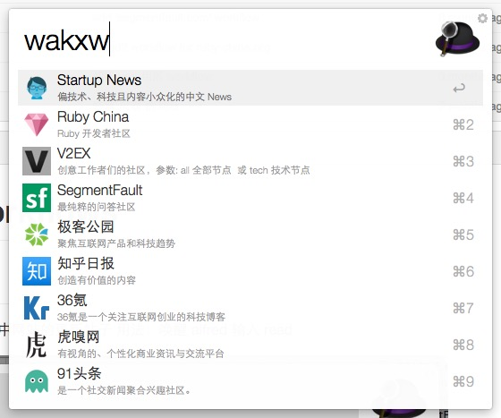
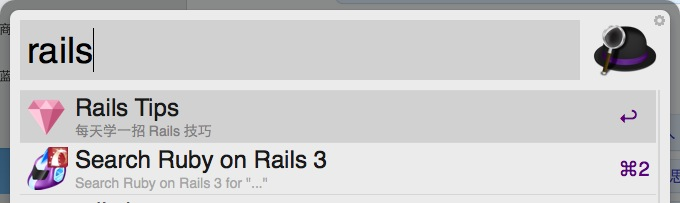
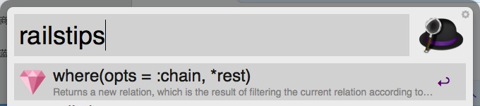
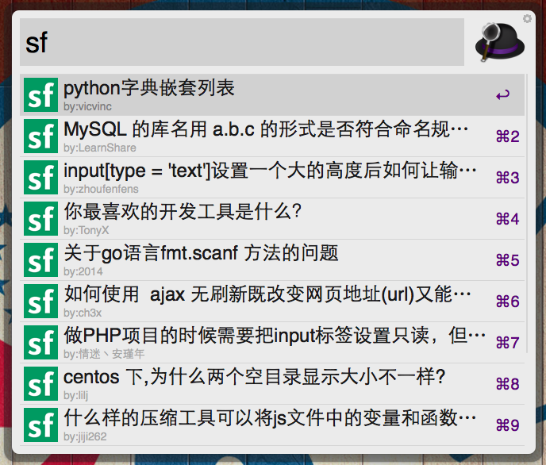

alfred2-workflows
=================
## 我爱看新闻

功能：阅读下面那些列表中网站的更新帖子
用法：唤醒 alfred 输入 wakxw 或者直接按 option + r

上面这些你都可以自己重新定义成喜欢的快捷键

## Rails Tips

功能：学习 rails 的小花招
用法：唤醒 alfred 输入 railstips 回车
数据地址：https://github.com/wjp2013/railstips 欢迎贡献内容

---

下面两个 workflow 可以单独安装

## ruby-chian.org 的新贴列表

## segmentfault.com 的新问题列表

